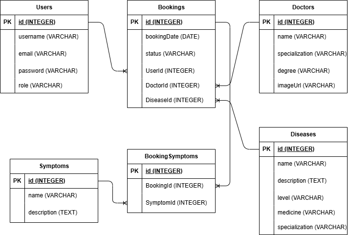

# HaloCoy - Pair Project Health

HaloCoy is a simple health appointment platform built with Express, EJS, and PostgreSQL. Users can register as patients, book appointments based on symptoms, and track bookings with QR codes. Admins can manage doctors, diseases, symptoms, and booking status.

## Features

- Authentication with role-based access (patient/admin)
- Patient booking flow with symptom selection
- Automatic disease and doctor matching by specialization
- Booking list with QR code summary
- Patient profile management
- Admin CRUD for doctors, diseases, and symptoms
- Booking status updates (pending/confirmed/done)

## Tech Stack

- Backend: Node.js, Express, Sequelize
- Database: PostgreSQL
- View: EJS
- Auth: express-session, bcryptjs

## Project Flow

```mermaid
flowchart TD
	A[Landing] --> B[Login / Register]
	B -->|Patient| C[Patient Dashboard]
	B -->|Admin| D[Admin Dashboard]

	C --> E[Book Appointment]
	E --> F[Select Symptoms]
	F --> G[Match Disease & Doctor]
	G --> H[Create Booking (Pending)]
	H --> I[My Bookings + QR Code]
	C --> J[My Profile]

	D --> K[Manage Doctors]
	D --> L[Manage Diseases]
	D --> M[Manage Symptoms]
	D --> N[List Patient Bookings]
	N --> O[Update Booking Status]
```

## ERD



## Routes Overview

### Public

- `GET /` landing page
- `GET /login` login page
- `POST /login` login submit
- `GET /register` register page
- `POST /register` register submit
- `GET /logout` logout

### Patient

- `GET /patients` dashboard
- `GET /patients/book` booking form
- `POST /patients/book` create booking
- `GET /patients/bookings` booking list + QR
- `GET /patients/doctors` list doctors
- `GET /patients/profile` profile form
- `POST /patients/profile` update profile

### Admin

- `GET /doctors` list doctors
- `GET /doctors/addDoctors` add doctor
- `POST /doctors/addDoctors` create doctor
- `GET /doctors/:id/editDoctors` edit doctor
- `POST /doctors/:id/editDoctors` update doctor
- `GET /doctors/deleteDoctors/:id` delete doctor
- `GET /doctors/diseases` list diseases
- `GET /doctors/addDiseases` add disease
- `POST /doctors/addDiseases` create disease
- `GET /doctors/:id/editDiseases` edit disease
- `POST /doctors/:id/editDiseases` update disease
- `GET /doctors/deleteDiseases/:id` delete disease
- `GET /doctors/symptoms` list symptoms
- `GET /doctors/addSymptoms` add symptom
- `POST /doctors/addSymptoms` create symptom
- `GET /doctors/:id/editSymptoms` edit symptom
- `POST /doctors/:id/editSymptoms` update symptom
- `GET /doctors/deleteSymptoms/:id` delete symptom
- `GET /doctors/:id/listPatientBookings` list bookings by doctor
- `POST /doctors/booking/:id/switchStatus` update booking status

## Setup

### Prerequisites

- Node.js
- PostgreSQL

### Installation

```bash
npm install
```

### Database

Update database settings in `config/config.json`, then run:

```bash
npx sequelize-cli db:create
npx sequelize-cli db:migrate
npx sequelize-cli db:seed:all
```

### Run App

```bash
node app.js
```

App runs on `http://localhost:3000`.

## Notes

- Patient routes are protected by session role `patient`.
- Admin routes are intended for role `admin`.
- Booking is created with `pending` status by default.

## Team

- Indraprasta Dwinanda Fahreza
- Evan
